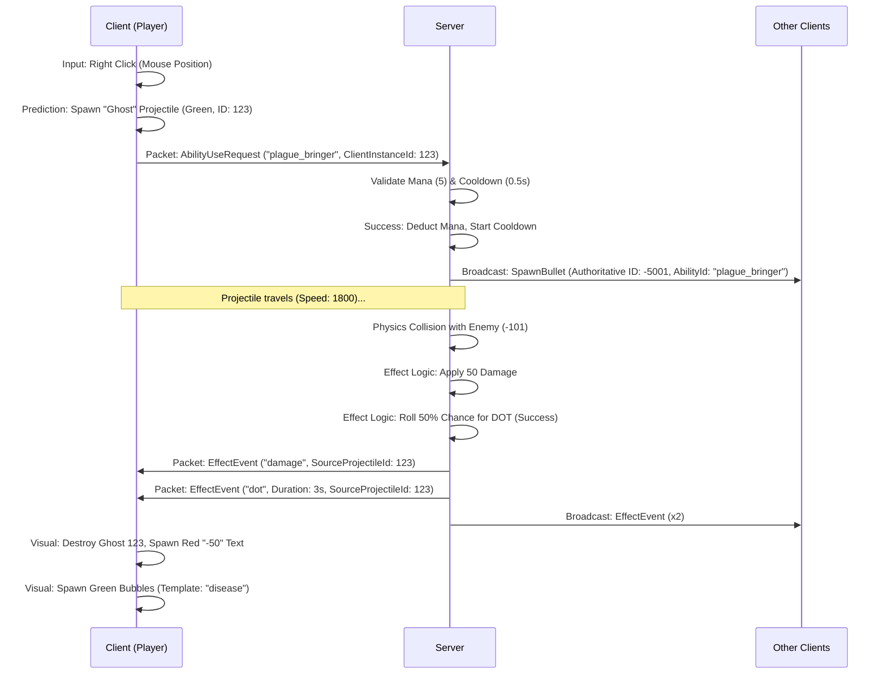
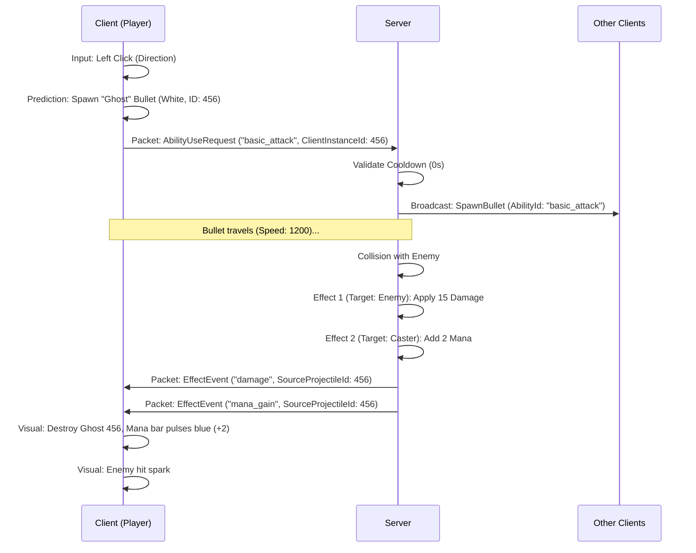

# ABILITY_SPEC.md (v4.2)

This document defines the data-driven schema for **LastLight**. The system uses a "Vehicle and Payload" architecture to separate the *Trigger* from the *Action*.

## 1. Core Architecture & Relationships

The system is composed of three hierarchical layers. A game designer "builds" an ability by nesting these components:

1.  **Ability Root (The Trigger):** The entry point. Handles "Business Logic" like naming, Mana consumption, and Cooldown timers.
2.  **Delivery (The Vehicle):** The physical manifestation in the game world. The `type` property inside the delivery object determines if it is a `projectile`, `channeled`, `contact`, or `instant`.
3.  **Effects (The Payload):** The results of an impact. A single Delivery carries an array of effects (e.g., Damage + Life Steal). Each effect can be filtered by `target_type`.

---

## 2. Component & Delivery Type Specifications

### 2.1 Ability Root
| Property | Type | Description |
| :--- | :--- | :--- |
| `id` | string | Unique internal identifier (e.g., `basic_attack`). |
| `name` | string | User-facing display name. |
| `icon` | string | Sprite ID for the skill bar / UI. |
| `mana_cost` | int | Mana consumed upon activation. |
| `cooldown` | float | Seconds before the ability can be reused. |
| `delivery` | object | The container for the Delivery Spec (Must contain a `type` string). |
| `effects` | array | List of [Effect Objects](#3-effects-the-payload). |

### 2.2 Delivery Types (The Vehicle)
The `delivery` object **must** contain a `type` property to determine logic.

#### **type: "projectile"**
*Entities moving through space with collision logic.*
* **`fire_rate`**: Number of shots per second.
* **`speed`**: Movement speed in units per second.
* **`pattern`**: Layout of shots (`straight`, `cone`, `circle`, `parallel`).
* **`count`**: Number of projectiles spawned per shot.
* **`range_tiles`**: Max distance (1 tile = 32px) before destruction.
* **`pierce`**: If `true`, continues through targets until max range.
* **`spread`**: Total arc degrees (for `cone` or `circle`).
* **`shape`**: `circle` or `rectangle` for collision math.
* **`width` / `height`**: Dimensions for the collider and sprite.
* **`color`**: RGB string (e.g., `255,255,255`) for procedural tinting.

#### **type: "beam"**
*Persistent area-of-effect manifestations (Beams, Streams, Auras).*
* **`tick_rate`**: Frequency of effect application (e.g., `0.1` applies damage 10 times a sec).
* **`mana_per_second`**: Continuous mana cost while active.
* **`length_tiles`**: The reach of the beam or stream.
* **`width_pixels`**: The thickness of the beam's collision line.

#### **type: "contact"**
*Triggered via physical collision between player and enemy hitboxes.*
* **`knockback_force`**: Magnitude of displacement on hit.
* **`cooldown_per_target`**: Delay to prevent rapid-fire hits on one frame.

#### **type: "instant"**
*Immediate application of effects in a designated area.*
* **`anchor`**: Where the effect originates (`caster` or `mouse_cursor`).
* **`radius`**: Distance around the anchor to apply effects. Set to `0` for self-only.

#### **type: "field"**
*Stationary, persistent area-of-effect zones (Fire patches, Poison clouds, Walls).*
* **`duration`**: Total seconds the field remains active.
* **`tick_rate`**: Frequency of effect application to entities inside the zone.
* **`shape`**: `circle` or `rectangle`.
* **`radius`**: Size of the circular zone (if circle).
* **`width` / `height`**: Dimensions of the rectangular zone (if rectangle).
* **`color`**: RGB string for visual representation.

### 2.3 Effects (The Payload)

The `effects` array contains objects that define what happens to the target(s) upon delivery. The server processes these in order. If a `chance` check fails, that specific effect (and only that one) is skipped.

* **Logic Routing (effect_name):** This is the most important field. It tells the server which C# function to run (e.g., "If this says dot, use the StatusManager; if it says damage, just subtract HP").
* **Targeting (target_type):** This defines the "Filter." Even if a bullet hits an enemy, an effect with target_type: "caster" will apply to the person who shot it (like Life Steal or Mana Gain).
* **Visual Linking (template_id):** This is a "hook" for the client. The server doesn't care what a "poison bubble" looks like, but by putting that ID here, you're telling the client: "When this hits, look up the poison_bubble settings in the graphics folder and play those particles."
* **Timing & Magnitude (value, multiplier, duration, tick_rate):** These are the knobs. By changing these in the JSON, you can turn a weak "Poison" (5 damage over 10 seconds) into a deadly "Plague" (50 damage over 2 seconds) without touching a single line of code.

---

## 3. Activation & Input Lifecycle

The game engine interprets input based on the **Delivery Type**. Any ability can be "Channeled" (held), but the result depends on whether the delivery is *Discrete* or *Continuous*.

| Input Mode | Logic Pattern | Delivery Type | Cost Type | Examples |
| :--- | :--- | :--- | :--- | :--- |
| **Tap** | **One-Shot:** Triggered exactly once per click. | `instant`, `projectile` | Flat Mana cost. | Blink, Grenade, Fireball (Single). |
| **Tap** | **Placement:** Spawns a persistent object at a location. | **`field`** | Flat Mana cost. | **Fire Trap, Stone Wall, Poison Cloud.** |
| **Hold (Repeating)** | **Discrete Pulse:** Spawns distinct objects at a set interval. | `projectile` | Per-Shot Mana cost. | **The Generator (Bow/Dagger)**, Machine Gun. |
| **Hold (Continuous)** | **Persistent Stream:** Maintains a single active hitbox with ticks. | **`beam`** | Mana-per-second. | **Staff Beam**, Flamethrower, Healing Aura. |

### 3.1 Input Logic Examples

#### Example A: The Bow (Hold to Shoot)
*   **Delivery:** `projectile` | `fire_rate: 2.0`
*   **Behavior:** Player holds left-click. The engine spawns a distinct arrow object every 0.5 seconds. If the player lets go, the firing stops instantly.

#### Example B: The Staff (Hold to Beam)
*   **Delivery:** `beam` | `tick_rate: 0.1` | `mana_per_second: 10`
*   **Behavior:** Player holds right-click. A visual beam connects the player to their cursor. Damage is calculated 10 times per second on any entity inside the beam's line. Mana drains continuously.

#### Example C: The Dash (Tap to Move)
*   **Delivery:** `instant` | `cooldown: 2.0`
*   **Behavior:** Player taps space. They teleport instantly. Holding space does nothing until the 2-second cooldown expires, at which point it triggers exactly once more.

#### Example D: The Fire Trap (Tap to Place)
*   **Delivery:** `field` | `duration: 5.0` | `tick_rate: 0.5`
*   **Behavior:** Player taps the ability key. A circular fire patch appears at the mouse cursor coordinates. It lasts for 5 seconds. Every 0.5 seconds, any enemy currently overlapping the patch receives the ability's effects (e.g., Damage + Burning).


### 3.1 JSON Schema: Effect Parameters (Design-Time)

> The total number for damage and healing is always server-authorative. The server tells us when to tick for damage
> and how much.

The server computes damage in two main ways, both defined in data:
- **multiplier**: This uses the weapon's base damage (if player), includes bonuses from skills and item Tier upgrades, then multiplies it times this `multiplier`. 
- **value**: This is for static damage, like a `DoT` that always has some base damage defined here. Generally when the server sees this, it skips weapon damage and uses this as the base damage. Very useful for static things like a movement speed increase.

So, we have both, but they are mutually exclusive.

This table defines the properties available in `abilities.json` for game designers to configure effects.


| Property | Type | Description |
| :--- | :--- | :--- |
| `effect_name` | string | The logic key (e.g., `damage`, `dot`, `buff`). |
| `target_type` | enum | `caster`, `enemies`, `allies`, `all`. |
| `template_id` | string | **Optional.** Visual ID (e.g., `"poison_bubble"`) to look up in `effect_templates.json`. |
| `multiplier` | float | **Scaling Factor.** 1.0 = 100% of Base Damage. Defaults to `1.0`. |
| `value` | float | **Flat Amount.** Used for flat stats (Buffs) or non-scaling values. |
| `damage_type`| enum | **Optional.** `physical`, `fire`, `frost`, `shock`, `poison`. |
| `chance` | float | **Optional.** Probability (0.0 to 1.0) to trigger. |
| `duration` | float | **Required for timed effects.** How long the status lasts in seconds. |
| `tick_rate` | float | **Required for DOT/HOT.** Seconds between periodic ticks. |
| `stat_type` | string | **Required for Buff/Debuff.** `attack`, `defense`, `speed`, `dexterity`. |

### 3.2 List of Effects

| Effect Name | Description | Required / Optional Parameters |
| :--- | :--- | :--- |
| **`damage`** | reduction of target health based on multiplier. | `multiplier` (e.g. 1.0), `damage_type`. |
| **`heal`** | increase of target health based on multiplier. | `multiplier` (e.g. 1.0). |
| **`mana_gain`** | increase of target mana based on multiplier. | `multiplier` (e.g. 1.0). |
| **`dot`** | Damage Over Time based on multiplier. | `multiplier` (per tick) or `value`, `duration`, `tick_rate`. |
| **`hot`** | Heal Over Time based on multiplier. | `multiplier` (per tick), `duration`, `tick_rate`. |
| **`buff`** | Temporary increase to a specific stat. | `value` (flat bonus), `duration`, `stat_type`. |
| **`debuff`** | Temporary decrease to a specific stat. | `value` (flat penalty), `duration`, `stat_type`. |
| **`remove_status`** | Removes an active status effect (Buff/Debuff/DOT). | `template_id` (the specific status to remove). |

### 3.3 Status Effect Lifecycle

To ensure perfect synchronization between the server's math and the client's visuals, status effects (DOT, HOT, Buff, Debuff) follow these lifecycle rules:

1.  **Application:** The server sends an `EffectEvent` with the `Duration` and `Value`. The client uses this to display the debuff icon and start particle systems.
2.  **Authoritative Ticks:** For DOT/HOT, the server sends a new `EffectEvent` (Type: `damage` or `heal`) **every time a tick occurs**. The client should not "guess" tick damage; it must wait for the server packet to show floating combat text.
3.  **Removal/Expiry:** When an effect expires naturally or is cleansed, the server sends an `EffectEvent` with **`EffectName: "remove_status"`** and the matching `TemplateId`. The client then stops the associated visual effects.

---


## 4. .NET Architecture & Networking

### 4.1 LastLight.Common (Shared Logic)

#### **`Abilities/AbilitySpec.cs`**
Contains the POCO classes for deserializing `abilities.json`.
- `AbilitySpec`: Root class.
- `DeliverySpec`: Base class for polymorphic delivery data.
- `EffectSpec`: Defines what happens on impact.

#### **`Abilities/EffectProcessor.cs`**
The core execution engine used by both Client and Server.
- `ApplyEffect(IEntity target, IEntity source, EffectSpec spec)`: Handles health/mana changes and applying status effects.

#### **`Abilities/StatusRegistry.cs`**
Manages active timed effects on entities.
- `StatusInstance`: Tracks duration and tick timers for a specific effect on an entity.
- `StatusManager`: Updated every frame to tick down durations and trigger periodic effects.

#### **Network Packets (Runtime)**

These packets facilitate communication between the Client and the Server.

**`AbilityUseRequest` (Client -> Server)**
Sent when a player triggers an ability.

| Field | Type | Description |
| :--- | :--- | :--- |
| `AbilityId` | string | Unique ID of the ability to use. |
| `Direction` | Vector2 | Normalized vector of the shot direction. |
| `TargetPosition`| Vector2 | World coordinates of the mouse/target. |
| `ClientInstanceId`| int | A local ID generated by the client to track its predicted projectile. |

**`SpawnBullet` (Server -> Broadcast)**
Informs clients to render a new projectile.

| Field | Type | Description |
| :--- | :--- | :--- |
| `OwnerId` | int | ID of the entity who fired. |
| `BulletId` | int | Authoritative server-side ID for this bullet. |
| `AbilityId` | string | **New.** Used by clients to look up visuals (color, size) from JSON. |
| `Position` | Vector2 | Starting world coordinates. |
| `Velocity` | Vector2 | Movement vector (speed included). |

**`EffectEvent` (Server -> Broadcast)**
Informs clients of a calculated event.

| Field | Type | Description |
| :--- | :--- | :--- |
| `EffectName` | string | What happened (e.g., `"damage"`, `"heal"`, `"remove_status"`). |
| `TargetId` | int | The ID of the entity receiving the effect. |
| `SourceId` | int | The ID of the entity who caused the effect. |
| `SourceProjectileId`| int | The `ClientInstanceId` of the bullet that caused this effect (used to destroy predicted ghosts). |
| `Value` | float | **Calculated.** The final numeric **Calculated** result (after defense/stat logic). |
| `Duration` | float | **Calculated.** The remaining time for a status effect. |
| `Position` | Vector2 | **Calculated.** The world coordinates where the event occurred. |
| `TemplateId` | string | The Visual/Audio ID from the original JSON configuration. |

### 4.2 LastLight.Server (Authoritative)
- `ServerAbilityManager`: Validates cooldowns and mana. Triggers `Delivery` logic.
- `ServerDeliveryProcessor`: Handles the physical manifestation (spawning projectiles, checking AoE).
- When a `Delivery` hits a target, it calls `EffectProcessor.ApplyEffect` and broadcasts `EffectEvent`.

### 4.3 LastLight.Client.Core (Visuals & Prediction)
- `ClientAbilityManager`: Spawns local "ghost" delivery objects for instant feedback.
- `ClientEffectHandler`: Listens for `EffectEvent` to:
  - Play sounds.
  - Spawn particles.
  - Show floating combat text.
  - Update local HP/Mana (reconciled by server updates).

### 4.4 Technical Runtime Mandates

To ensure the system works as intended, the following runtime rules apply:

*   **Network Rule:** Every single point of health or mana changed by a DOT, HOT, or Buff must be backed by an `EffectEvent` packet from the server.
*   **Engine Update Rule:** Both the Client and Server game loops **MUST** call `StatusManager.Update(dt)` every frame to process active status durations and tick timers.
*   **Authoritative Death Sweep:** The server **MUST** perform a health check (`CheckAllDeaths`) at the end of every logic frame to process entities killed by status ticks or direct effects.
*   **Reasoning:** This prevents "Desync Deaths" where a client thinks a player is alive with 5 HP but the server-side tick already killed them. It also prevents memory leaks by ensuring expired statuses are purged from the registry.

---

## 5. Implementation Examples

### 5.1 Basic Attack

This is an example of the **Generator** type weapon ability. It does `Physical` damage and generates mana.

```json
{
  "id": "basic_attack",
  "name": "Quick Shot",
  "icon": "icon_attack_01",
  "mana_cost": 0,
  "cooldown": 0,
  "delivery": {
    "type": "projectile",
    "fire_rate": 5.0,
    "speed": 1200,
    "pattern": "straight",
    "count": 1,
    "range_tiles": 12,
    "shape": "circle",
    "width": 8,
    "height": 8,
    "color": "255,255,255"
  },
  "effects": [
    { 
      "effect_name": "damage",
      "target_type": "enemies",
      "multiplier": 1.0, 
      "damage_type": "physical" 
    },
    { 
      "effect_name": "mana_gain", 
      "target_type": "caster",
      "value": 2
    }
  ]
}

```

### 5.2 Disease Sniper

This is an example of a **Special** ability from a weapon.

```json
{
  "id": "disease_sniper_ability",
  "name": "Plague Bringer",
  "icon": "icon_sniper_01",
  "mana_cost": 5,
  "cooldown": 0.5,
  "delivery": {
    "type": "projectile",
    "fire_rate": 2.0,
    "speed": 1800,
    "pattern": "straight",
    "count": 1,
    "range_tiles": 20,
    "shape": "rectangle",
    "width": 16,
    "height": 4,
    "color": "75,150,75"
  },
  "effects": [
    { 
      "effect_name": "damage",
      "target_type": "enemies",
      "multiplier": 1.5, 
      "damage_type": "physical" 
    },
    { 
      "effect_name": "dot", 
      "target_type": "enemies",
      "template_id": "disease",
      "value": 5, 
      "damage_type": "physical",
      "duration": 3.0,
      "tick_rate": 1.0,
      "chance": 0.5 
    }
  ]
}
```

## 6. Network Walkthrough

This section walks through the lifecycle of two different abilities to show how prediction, networking, and the payload (effects) interact.

### 6.1 Special Ability: Disease Sniper (Plague Bringer)

This ability features a 5-mana cost, a 0.5s cooldown, and a 50% chance to apply a Damage-Over-Time (DOT) effect.

#### **High-Level Flow Diagram**



#### **Timeline Detail**
| Step | Location | Event | Visuals / Network |
| :--- | :--- | :--- | :--- |
| **0ms** | Client | **Input Trigger** | Player clicks. `ClientAbilityManager` spawns a green bullet immediately. |
| **5ms** | Network | **Request Sent** | `AbilityUseRequest` sent with target coordinates and `ClientInstanceId: 123`. |
| **40ms**| Server | **Validation** | Server checks `mana_cost` and `cooldown`. Passes. |
| **45ms**| Network | **Sync Spawn** | `SpawnBullet` broadcast with `AbilityId`. Other players now see the green bullet. |
| **200ms**| Server | **Collision** | Server detects hit on Enemy `-101`. Bullet is destroyed. |
| **205ms**| Server | **Processing** | `EffectProcessor` reduces HP. `StatusManager` adds 3s DOT. |
| **210ms**| Network | **Impact Sync** | `EffectEvent` packets sent with `SourceProjectileId: 123`. |
| **250ms**| Client | **Resolution** | Client destroys Ghost 123, sees "-50" text and green particles. |

---

### 6.2 Primary Generator: Quick Shot (Basic Attack)

This is a high-speed, zero-mana "left-click" ability that restores mana to the caster on hit.

#### **High-Level Flow Diagram**



#### **Timeline Detail**
| Step | Location | Event | Visuals / Network |
| :--- | :--- | :--- | :--- |
| **0ms** | Client | **Input Trigger** | Left click. High fire-rate (5/sec) means rapid ghost bullets. |
| **40ms**| Server | **Validation** | 0 Mana cost = Always passes. |
| **150ms**| Server | **Impact** | Bullet hits enemy. |
| **155ms**| Server | **Payload** | Caster's mana is increased by 2. Enemy takes 15 damage. |
| **200ms**| Client | **Feedback** | `EffectEvent` with `SourceProjectileId` triggers cleanup and blue flash. |

---

### 6.3 Desync Case: Correcting a "False Hit" (Bad Prediction)

In this scenario, the Client thinks they hit a fast-moving enemy, but the Server (the source of truth) rules it a miss.

#### **Sequence Timeline**

| Step | Location | Event | Result |
| :--- | :--- | :--- | :--- |
| **0ms** | Client | **Input Trigger** | Player fires. Ghost bullet `ID: 99` spawned locally. |
| **100ms**| Client | **False Hit** | On the player's screen, the ghost bullet overlaps an enemy. |
| **105ms**| Client | **Visual Prediction**| **Client hides Ghost 99** and spawns a "Spark" particle. (Client assumes success). |
| **150ms**| Server | **Authoritative Miss**| The bullet passes through the enemy hitbox on the server due to latency. |
| **155ms**| Server | **Expiry** | The bullet reaches max range and is destroyed silently. |
| **200ms**| Client | **Resolution (Sync)** | The client **NEVER** receives an `EffectEvent` for Ghost 99. |
| **205ms**| Client | **Correction** | The client realizes the ghost was hidden but no server confirmation arrived. The "Spark" was just a visual lie; the Enemy HP bar does not move. |

**Note on Correction:** Because the Client only updates HP bars and spawns Floating Combat Text when an `EffectEvent` arrives, "False Hits" are automatically corrected. The player sees a spark, but no damage number appears, indicating the miss.
