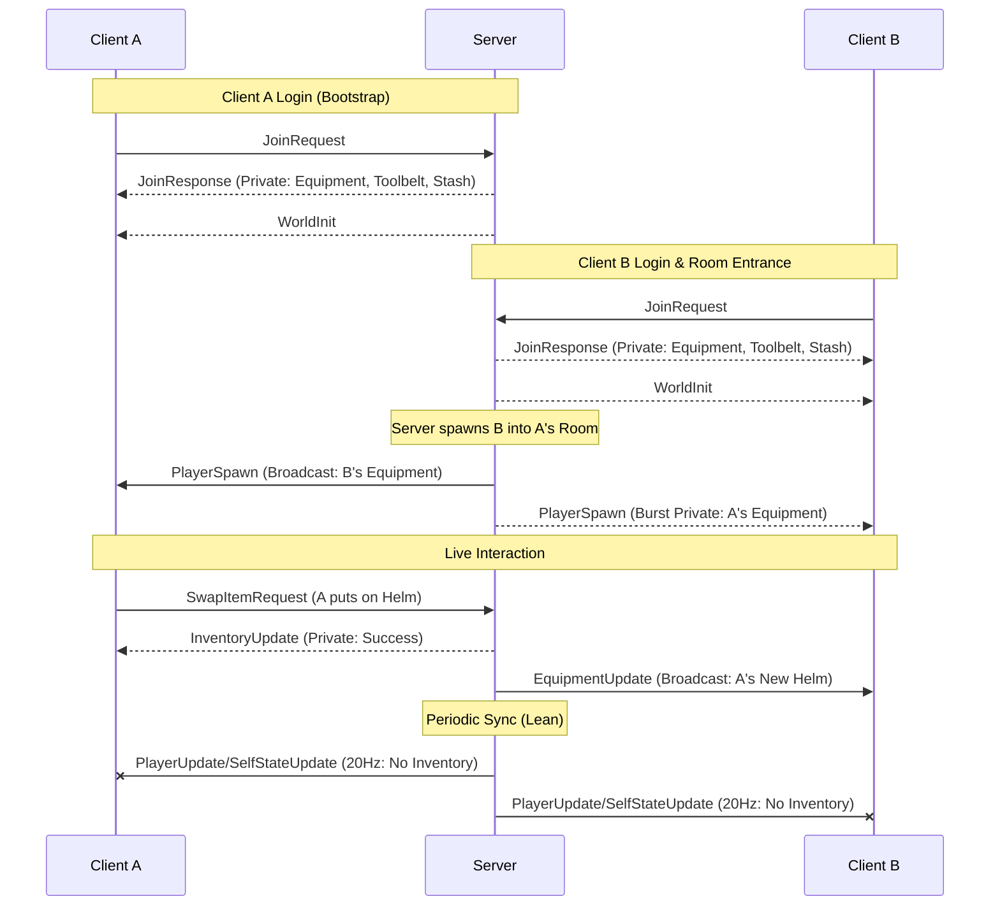

# NETWORK SPECIFICATION

## 1. Overview (v1.0)
This document defines the communication protocol between the LastLight Client and Server. It utilizes a **Pure UDP** transport (via LiteNetLib) with an **Authoritative Server / Predictive Client** architecture. The system is optimized for high-intensity bullet-hell combat where low latency and state reconciliation are critical.

## 2. Design Goals & Functional Requirements

### 2.1 Data Visibility & Transmission Rules
To optimize bandwidth and prevent cheating (info-glance), data is categorized into three visibility tiers:

| Tier | Recipient | Logic | Example Data |
| :--- | :--- | :--- | :--- |
| **Broadcast** | All in Room | Sent periodically or on event to everyone. | Position, Health, Projectiles, Equipment. |
| **Private** | Specific Peer | Sent only to the owner of the data. | Mana, Experience, Toolbelt, Stash, DungeonLoot. |
| **Request** | Server | Input or intent sent from client to server. | Movement, Ability Use. |

### 2.2 Periodic State Synchronization
The server broadcasts the world state **20 times per second (20Hz / every 50ms)** to ensure all clients have a consistent view of the game world.

### 2.3 Prediction & Reconciliation

#### Movement (Local Prediction)
1.  Client moves instantly and sends `InputRequest` with a `SequenceNumber`.
2.  Server validates the move and sends `PlayerUpdate` with the `LastProcessedSequence`.
3.  If the Server position differs significantly, the Client **snaps** to the server's position and re-plays any pending inputs.

#### Combat (Visual Prediction)
1.  On click, Client spawns a "Ghost" projectile with a local ID.
2.  Client sends `AbilityUseRequest` to Server.
3.  The Ghost travels until the Client receives an `EffectEvent` containing the matching `SourceProjectileId`.
4.  Client destroys the Ghost and spawns the authoritative hit visual at the `Position` provided by the server.

## 3. Data Specification (Packets)

### 3.1 Connection Packets
*Initial handshake and connection state between client and server.*

*   **`JoinRequest` (Request | Event | Reliable):** Client requesting to join the server.
    *   `Username`: string
*   **`JoinResponse` (Private | Event | Reliable):** Server's response to the client's join attempt.
    *   `Success`: bool
    *   `PlayerId`: int (The server-assigned network ID for this client)
    *   `Message`: string
    *   `MaxHealth`: int
    *   `Level`: int
    *   `Experience`: int
    *   `RunGold`: int
    *   `Equipment`: ItemInfo[] (Length 5)
    *   `Toolbelt`: ItemInfo[] (Length 3-8; starts at 3)
    *   `Stash`: ItemInfo[] (Length 50)
    *   `DungeonLoot`: ItemInfo[] (Length 50; items collected during current run)
    *   `Attack`: int
    *   `Defense`: int
    *   `Speed`: int
    *   `Dexterity`: int
    *   `Vitality`: int
    *   `Wisdom`: int

### 3.2 Player Packets
*Consolidates all state updates, input, and lifecycle events for players.*

*   **`InputRequest` (Request | Periodic | Unreliable):** Client sending movement intent to the server.
    *   `Movement`: Vector2 (Normalized directional input)
    *   `DeltaTime`: float (Client-side time elapsed)
    *   `InputSequenceNumber`: int (Used for client-side prediction reconciliation)
*   **`PlayerSpawn` (Broadcast | Event | Reliable):** Informs clients to instantiate a new player entity in their current room.
    *   `PlayerId`: int
    *   `Username`: string
    *   `Position`: Vector2
    *   `MaxHealth`: int
    *   `Level`: int
    *   `Equipment`: ItemInfo[] (Length 5 - used for visual synchronization)
*   **`PlayerUpdate` (Broadcast | Periodic | Unreliable):** Lean packet for public presence. Renamed from AuthoritativePlayerUpdate.
    *   `PlayerId`: int
    *   `Position`: Vector2
    *   `Velocity`: Vector2 (for dead-reckoning)
    *   `CurrentHealth`: int
    *   `LastProcessedInputSequence`: int
*   **`EquipmentUpdate` (Broadcast | Event | Reliable):** Broadcast when any player in the room changes their active gear.
    *   `PlayerId`: int
    *   `SlotIndex`: int
    *   `Item`: ItemInfo
*   **`PlayerLeave` (Broadcast | Event | Reliable):** Sent when a player disconnects or transitions to a different room. 
    *   `PlayerId`: int (tells client to completely remove the player from the local dictionary and rendering pool)
*   **`SelfStateUpdate` (Private | Periodic | Unreliable):** Sent only to the local player to sync their personal UI. Stripped of inventory data to maintain 200Hz loop stability.
    *   `CurrentMana`: int
    *   `MaxMana`: int
    *   `Experience`: int
    *   `RunGold`: int
    *   `Stats`: (Attack, Defense, Speed, Dexterity, Vitality, Wisdom)

### 3.3 Entity Lifecycle Packets
*Consolidates all state updates and lifecycle events for non-player enemies/bosses.*

*   **`EntitySpawn` (Broadcast | Event | Reliable):** Informs clients to instantiate a new non-player entity.
    *   `EntityId`: int (authoritative ID, typically negative)
    *   `DataId`: string (the JSON lookup key in `Enemies.json`)
    *   `Position`: Vector2
    *   `MaxHealth`: int
*   **`EntityUpdate` (Broadcast | Periodic | Unreliable):** Periodic sync for non-player entities.
    *   `EntityId`: int
    *   `Position`: Vector2
    *   `CurrentHealth`: int
    *   `Phase`: byte (used for client-side visual transitions)
*   **`EntityDeath` (Broadcast | Event | Reliable):** 
    *   `EntityId`: int (tells client to remove from dictionary and play death VFX)

### 3.4 Spawner Lifecycle Packets
*Consolidates all state updates and lifecycle events for mob spawners.*

*   **`SpawnerSpawn` (Broadcast | Event | Reliable):** Informs clients to instantiate a new spawner entity.
    *   `SpawnerId`: int
    *   `Position`: Vector2
    *   `MaxHealth`: int
*   **`SpawnerUpdate` (Broadcast | Periodic | Unreliable):** Periodic sync for spawners.
    *   `SpawnerId`: int
    *   `CurrentHealth`: int
*   **`SpawnerDeath` (Broadcast | Event | Reliable):** Tells client to remove spawner and play death VFX.
    *   `SpawnerId`: int

### 3.5 Portal Packets
*Events related to transitioning between rooms.*

*   **`PortalSpawn` (Broadcast | Event | Reliable):** Informs clients to display an interactive portal.
    *   `PortalId`: int
    *   `Position`: Vector2
    *   `TargetRoomId`: int
    *   `Name`: string
*   **`PortalUseRequest` (Request | Event | Reliable):** Client intent to enter a portal.
    *   `PortalId`: int
*   **`PortalDeath` (Broadcast | Event | Reliable):** Informs clients to remove a portal (e.g. collapsing dungeon).
    *   `PortalId`: int

### 3.6 Inventory & Items Packets
*   **`InventoryUpdate` (Private | Event | Reliable):** Sent to a player when their bag changes (e.g., equipment swap, chest reward).
    *   `Collection`: byte (0 = Equipment, 1 = Toolbelt, 2 = Stash, 3 = DungeonLoot)
    *   `SlotIndex`: int (The local index within the specified collection)
    *   `Item`: ItemInfo (The complete instance data of the item being placed into the slot)
*   **`ItemSpawn` (Broadcast | Event | Reliable):** Notifies everyone that a loot item has dropped on the ground.
    *   `ItemId`: int (The unique server-assigned network ID for this dropped item instance)
    *   `Item`: ItemInfo (The complete data of the item, including its data lookup ID, tier, and specific modifiers)
    *   `Position`: Vector2 (The world coordinates where the item should visually appear)
*   **`ItemPickup` (Broadcast | Event | Reliable):** Notifies everyone to remove the ground item from their world.
    *   `ItemId`: int (The unique network ID of the item being picked up)
    *   `PlayerId`: int (The ID of the player who picked up the item, potentially used for visual feedback or UI logs)
*   **`SwapItemRequest` (Request | Event | Reliable):** Client intent to move an item.
    *   `FromCollection`: byte (0 = Equipment, 1 = Toolbelt, 2 = Stash, 3 = DungeonLoot)
    *   `FromIndex`: int
    *   `ToCollection`: byte (0 = Equipment, 1 = Toolbelt, 2 = Stash, 3 = DungeonLoot)
    *   `ToIndex`: int
*   **`UseItemRequest` (Request | Event | Reliable):** Client intent to consume an item from their inventory.
    *   `Collection`: byte (0 = Equipment, 1 = Toolbelt, 2 = Stash, 3 = DungeonLoot)
    *   `SlotIndex`: int

### 3.7 Combat & Abilities Packets
*   **`FireRequest` (Request | Event | Reliable):** (Legacy/Basic attack request).
    *   `BulletId`: int
    *   `Direction`: Vector2
*   **`AbilityUseRequest` (Request | Event | Reliable):** Client's intent to fire. Includes `ClientInstanceId` for prediction cleanup.
    *   `AbilityId`: string (The lookup key in `Abilities.json` determining what ability is being cast)
    *   `Direction`: Vector2 (The normalized direction vector of the attack, usually derived from the right joystick)
    *   `TargetPosition`: Vector2 (The specific world coordinate targeted, used for area-of-effect or targeted spells)
    *   `ClientInstanceId`: int (A local, temporary ID generated by the client for the "ghost" bullet. Used to match and destroy the ghost when the server responds)
*   **`SpawnBullet` (Broadcast | Event | Reliable):** Server's confirmation that a projectile exists. Includes `AbilityId` for visual lookup and `LifeTime` for authoritative range synchronization.
    *   `OwnerId`: int (The ID of the caster; used by client to filter friendly vs hostile projectiles)
    *   `BulletId`: int (Unique server-assigned ID for reconciliation)
    *   `AbilityId`: string (Lookup key in `Abilities.json` for visual properties like color and size)
    *   `Position`: Vector2 (The starting world coordinates of the projectile)
    *   `Velocity`: Vector2 (The authoritative speed and direction vector used for client-side movement)
    *   `LifeTime`: float (Authoritative duration in seconds before the bullet is destroyed; calculated by server as `range / speed`)
*   **`EffectEvent` (Broadcast/Filtered | Event | Reliable):** The result of an impact. Includes `SourceProjectileId` to tell the shooter to destroy their local "ghost."
    *   `EffectName`: string (e.g., "damage", "heal" - determines the client-side visual/audio response)
    *   `TargetId`: int (The ID of the entity or player receiving the effect)
    *   `SourceId`: int (The ID of the entity or player who caused the effect)
    *   `SourceProjectileId`: int (The ID of the bullet that caused the effect, used to destroy local predicted ghost bullets)
    *   `Value`: float (The magnitude of the effect, such as damage or heal amount)
    *   `Duration`: float (How long the effect lasts if it is a status condition like poison or stun)
    *   `Position`: Vector2 (The world coordinates where the effect occurred, used for spawning particles)
    *   `TemplateId`: string (Lookup key for complex effect definitions in JSON data)
*   **`BulletHit` (Broadcast | Event | Reliable):** Server notifying everyone that a bullet impacted an entity. Used to play hit visuals/SFX and destroy local ghosts.
    *   `BulletId`: int
    *   `TargetId`: int
    *   `TargetType`: EntityType

### 3.8 World & Room Packets
*   **`WorldInit` (Private | Event | Reliable):** Sent when a player enters a new room to build the map.
    *   `Seed`: int
    *   `Width`: int
    *   `Height`: int
    *   `TileSize`: int
    *   `Style`: GenerationStyle
    *   `CleanupTimer`: float
*   **`RoomStateUpdate` (Broadcast | Periodic | Unreliable):** Periodic sync for room-wide states.
    *   `CleanupTimer`: float
*   **`LeaderboardUpdate` (Broadcast | Periodic | Unreliable):** Syncs the top scores for the current room.
    *   `Entries`: LeaderboardEntry[]

## 4. Technical Implementation

### 4.1 Security Mandates
1.  **No Stats in Broadcast:** A player's raw stats (e.g., Wisdom, Dexterity) are **never** broadcast to other players.
2.  **Server-Side Cooldowns:** The server ignores `AbilityUseRequest` if the time since the last valid use is less than `1/fire_rate`.
3.  **Range Enforcement:** The server destroys projectiles that exceed their `range_tiles` setting, regardless of client state.

### 4.2 Catch-up Burst & Visual Sync
When a player enters a room, visual synchronization is achieved via two mechanisms:
1.  **Broadcast:** The server broadcasts the joining player's `PlayerSpawn` (including `Equipment`) to all existing occupants.
2.  **Burst:** The server sends a burst of `PlayerSpawn` packets (Private to the joiner) for every existing player currently in the room. This ensures the joining player has the correct visuals for the entire room state before the first 20Hz update arrives.

### 4.3 Transport Layer
The communication is handled by **LiteNetLib**.
- **Unreliable:** Used for `InputRequest` and `PlayerUpdate` where the latest state is more important than missing packets.
- **Reliable Ordered:** Used for state transitions like `AbilityUseRequest`, `ItemPickup`, and `InventoryUpdate` where execution order and delivery are mandatory.
